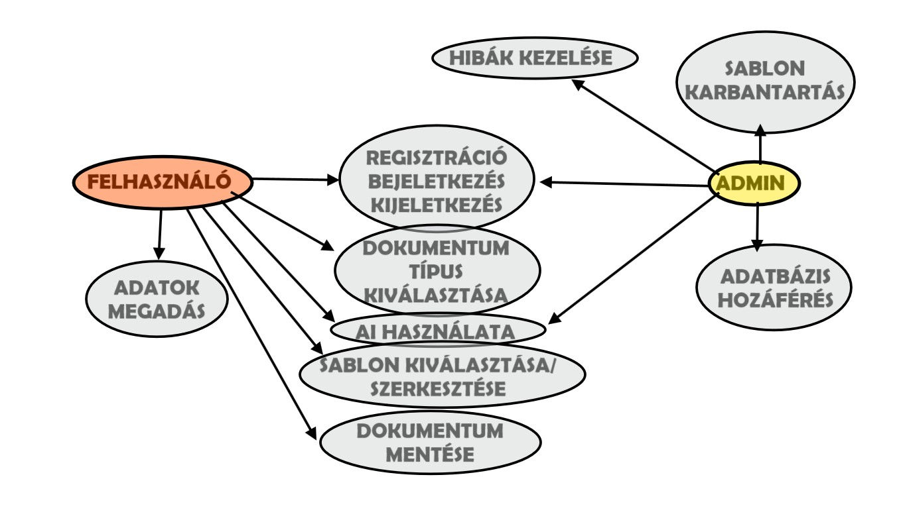
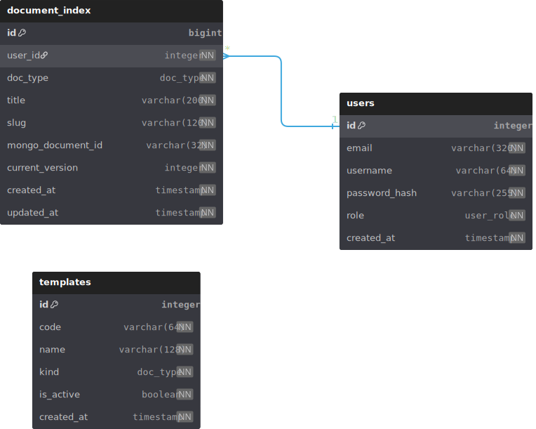

# Rendszerterv

## 1. A rendszer célja

A rendszer célja, hogy megkönnyítse az emberek számára az önéletrajz és a motivációs levél megírását. A mai világban az emberek nehezen tudnak olyan dokumentumokat írni ami nyelvtanilag helyes és szakmailag is megállja a helyét. Ezt hivatott megkönnyíteni ez a rendszer, amely mesterséges intelligencia segítségével elkészíti a kívánt önéletrajzot és motivációs levelet. Csupán az adatainak megadásával kaphat egy jó alapot amit alakithat.

Emellett azoknak is jutt hely, akik nem bíznak a mesterséges intelligenciában, vagy szimplán jobban szeretik saját maguk megírni ezen dokumentumokat. Az oldal nekik sablonokat tartogat, amik közül kiválaszthatják a nekik tetszöt.

A cél mindkét esetben az lenne, hogy egy szép, rendezett, összeszedett és átlátható önéletrajzot vagy motivációs levelet tudjon küldeni a munkaadónak.

## 2. Üzleti folyamatok modellje



## 3. Követelmények


### Funkcionális követelmények

 - Felhasználók adatainak eltárolása
 - Mükdöjön gépen valamint mobilon a rendszer
 - Sablonok generálása mesterséges intelligenciával
 - Adatok beillesztése mesterséges intelligenciával
 - Manuális dokumentumkészítés
 - Dokumentum lementése az eszközre

### Nem funkcionális követelmények

 - A felhasználó ne jusson más felhasználók adataihoz
 - Átlátható kezelőfelület
 - Gyors működés

 ### Törvényi előírások és szabványok

  - GDPR -nak való megfelelés
  - ISMS -nek megfelelő biztonság elérése

## 4. Funkcionális terv

### Rendszerszereplők

 - Admin
 - Flehasználó

### Rendszerhasználati esetek és lefutásaik

 - Admin
    - Be tud jeletkezni, mint felhasználó ezáltal látja ezen szerepkör környezetét
    - Látja a felhasználók adatai, amivel regisztráltak, valamint amiket a mesterséges intelligenciának adott
    - Sablonokat tudja változtatni/kicserélni
    - Hibákat javít ha talál

 - Felhasználó
    - Regisztrálni tud és az itt megadott adatokkal be tud jelentkezni
    - Ki tudja választani, hogy önéletrajzot vagy motivációs levelet szertne készíteni
    - Ki tudja választani, hogy mesterséges intelligencia segítségével vagy manuálisan készíti el a bizonyos dokumentumot
    - Megtudja adni a mesterséges intelligenciának a kért adatokat és feldolgozás után a kitöltöt dokumentumot visszaküldi sablon formában
    - Az elkészített dokumentumokat letudja tölteni az eszközére

### Menü-hierarchiák

- Bejelentkezés
    - Bejelentkezés
    - Regisztráció

- Főoldal
    - CV készítés
    - Motivációs levél készítés
    - Kijelentkezés

- CV készítés
    - Mesterséges inteligenciával
    - Manuálisan

- Motivációs levél készítés
    - Mesterséges inteligenciával
    - Manuálisan


## 5. Fizikai környezet

Az alkalmazás webes platformra készül, amely elsősorban desktop, de mobil eszközökön is elérhető lessz böngészőn keresztül. A modern, reszponzív felület biztosítja a zökkenőmentes felhasználói élményt minden eszközön.

**Fejlesztői eszközök:** Visual Studio Code, WebStorm

**Frontend technológiák:** React.js, HTML5, CSS3

**Backend technológiák:** Node.js, Express.js

**Adatbázis-kezelő rendszerek:** PostgreSQL, pgAdmin, MongoDB, MongoDB Compass

**Külső API-k és szolgáltatások:** Google Gemini API, jsPDF

**Cloud hosting platform:** Microsoft Azure

**Verziókezelés és DevOps:** Git és GitHub

## 6. Absztrakt domain modell

### Domain Objektumok

- User
- Profile
- CV
- WorkExperience
- Education
- Skill
- Language
- CoverLetter
- Template
- AIRequest

### Főbb folyamatok és domain logika

#### Dokumentumgenerálás folyamat (AI-alapú)

- Felhasználói input: A User kitölti az űrlapot a frontend felületen
- Validálás: A backend érvényesíti a bemeneti adatokat
- AI modul hívása: AIRequest entitás jön létre, a backend meghívja a Google Gemini API-t
- JSON válasz feldolgozása: Az AI strukturált JSON formátumban visszaküldi a generált tartalmat
- Az AI válasz visszaküldése a felhasználónak
- A felhasználó javíthat a generált JSON értékeken
- Mentés: CV vagy CoverLetter entitás létrehozása
- Sablon kiválasztása: A felhasználó kiválaszt egy Template-et
- PDF generálás: A frontend PDF generáló könyvtár segítségével elkészíti a dokumentumot
- Letöltés: A felhasználó letöltheti a PDF-et

#### Manuális dokumentumkészítés folyamat

- Űrlap kitöltése: A felhasználó minden mezőt manuálisan kitölt AI segítség nélkül
- Adatok mentése: A rendszer JSON struktúrába menti az adatokat
- Sablon kiválasztása és export: Ugyanaz, mint az AI-alapú folyamatnál

#### Verziókezelés

- Egy felhasználó több dokumentumverziót tárolhat különböző célpozíciókra
- Minden dokumentumnak egyedi azonosítója és neve van, a nevet a felhasználó adja
- A contentJSON mező rugalmas tartalomtárolást tesz lehetővé

#### Biztonság és adatvédelem a domain szintjén

- Jelszókezelés: A passwordHash mező bcrypt algoritmussal hash-elt jelszót tárol, így a jelszó soha nem kerül plain text formában mentésre
- Munkamenet-kezelés: JWT token alapú hitelesítés biztosítja, hogy csak a bejelentkezett felhasználók férjenek hozzá saját adataikhoz
- Titkosított kommunikáció: Minden adat HTTPS protokollon keresztül kerül átvitelre
​

## 7. Architekturális terv



### Backend

- Node.js + Express REST API

- Fő modulok: Auth, Users, Documents CV és letter, Templates, PDF, AI Orchestrator, Logging, Export

- JSON a belső tartalomformátum

- AI Orchestrator külső AI API‑t hív személyre szabott CV generáláshoz, bemenet a felhasználói űrlapadat, kimenet strukturált JSON, amely a fiókhoz mentődik és szerkeszthető

- Hitelesítés JWT‑vel, jelszó hash‑elve

- Biztonság: HTTPS kötelező, AI API kulcs csak szerveren, bemeneti validáció minden végponton, OWASP best practice, titkosítás tranzitban és nyugalomban

### Adatbázis

- PostgreSQL a törzs és metaadatokra: users, sessions/tokens, document_index, templates, exports, audit_logs, consents, password_resets; a document_index sor kapcsolja a dokumentum metaadatokat a MongoDB-ben tárolt tartalomhoz

- MongoDB (dokumentum-tároló) a rugalmas tartalomra és verziózásra: documents kollekció a CV/levél teljes JSON tartalommal és szerkesztési állapotokkal, document_versions kollekció visszagörgethető változatokkal, valamint opcionális ai_jobs a bemenet/kimenet és validáció naplózására az AI-folyamatokhoz.

- Indexelés és teljesítmény: MongoDB-ben indexek userId + documentId, updatedAt és type mezőkre a tartalom-lekérésekhez és verziólistákhoz.

### Web kliens

- Reactreszponzív UI, űrlap‑vezérelt adatbevitel, élő validáció és állapotjelzések (loading, hiba) AI hívásoknál

- Funkciók: regisztráció/bejelentkezés, profiladatok, AI‑alapú és manuális CV szerkesztő, sablonválasztó, verziók listája, PDF exportok letöltése.

### AI integráció

- Backend AI Orchestrator modul felel a prompt‑összeállításért, kimenet‑validációért (JSON schema), visszatérési idempotencia‑kulcsért és hibák elegáns degradációjáért (fallback manuális módra)

- AI bemenet: személyes adatok, tapasztalat, képzettség, készségek, célpozíció

- AI kimenet: strukturált CV/levél JSON szerkeszthető mezőkkel és szerkezettel.

- Átláthatóság: AI‑használat jelzése, manuális felülbírálhatóság, export előtti előnézet

### PDF és sablonok

- Sablonmotor több stílussal, szöveg‑alapú PDF generálás képi szöveg beágyazása nélkül az ATS kompatibilitásért.

- Export szolgáltatás soros feldolgozással és várólistával, hogy elkerülje renderelési tüskék okozta erőforrás‑kimerülést.

- Export naplózás verzió és sablonazonosítóval, re‑generálhatóság biztosítása azonos tartalomból.

### API vázlat

- Auth: POST /auth/register, POST /auth/login, POST /auth/forgot, POST /auth/reset, POST /auth/refresh.

- Profile: GET/PUT /users/me.

- Documents:
  - CV: POST /cv (AI), POST /cv/manual, GET /cv/:id, PUT /cv/:id, GET /cv, POST /cv/:id/export.
  - Cover letter: POST /letters (AI), POST /letters/manual, GET/PUT /letters/:id, GET /letters, POST /letters/:id/export.

- Templates: GET /templates, GET /templates/:id (admin: POST/PUT/DELETE).

- Compliance: GET /me/consents, POST /me/consents, DELETE /me/account (törlés).

### Üzemeltetés

Architektúra Azure Virtual Machine‑en: 1–2 darab Linux alapú VM a Backend Gateway és a háttér‑workerek futtatására, PostgREST a VM‑en szolgáltatásként fut a PostgreSQL mellett, MongoDB külön VM‑en vagy ugyanazon a példányon dedikált erőforrás‑profilokkal, hálózati szegmentációval.

## 8. Adatbázis terv

A webapp adatbázisa két tárolási rétegre lesz bontva: relációs (PostgreSQL) a felhasználói fiókokhoz, biztonsági és metaadat-kezeléshez, valamint egy dokumentumorientált (MongoDB) a rugalmas, verziózható CV/levél tartalomhoz és AI-folyamat naplózáshoz.

### Áttekintés

PostgreSQL: users, sessions/tokens, templates, exports, consents, password_resets, audit_logs, document_index meta-táblák a jogosultság, megfelelés és kereshetőség miatt.

​MongoDB: documents, document_versions és ai_jobs kollekciók a struktúrált JSON tartalom és AI-folyamatok tárolására, indexelve userId, documentId, type, updatedAt szerint a gyors lekérdezéshez.

### Elv és felosztás

- PostgreSQL: felhasználói fiókok, sablon meta és a dokumentumok könnyű listázhatóságát segítő index-meta (referenciák a Mongo objektumokra).

- MongoDB: dokumentumtartalom JSON-ban és minden verzió külön dokumentumban, AI-folyamat napló opcionálisan ide tehető a későbbiekben.

### PostgreSQL táblák

- **users:** id (PK), email UNIQUE, username UNIQUE, password_hash, role ENUM('user','admin'), created_at.
Indexek: unique(email), unique(username), idx_users_role.
  
- **templates:** id (PK), code UNIQUE, name, kind ENUM('cv','cover_letter'), is_active, created_at.
*Megjegyzés: schema_json nem kötelező az MVP-hez.*

- **document_index:** id (PK), user_id (FK → users.id), doc_type ENUM('cv','cover_letter'), title, slug UNIQUE per user, mongo_document_id (ObjectId hex), current_version INT, updated_at, created_at.
Indexek: unique(user_id, slug), idx_doc_user, idx_doc_type, idx_doc_updated_at.
​

### MongoDB kollekciók

- **documents:** _id ObjectId, userId (Postgres users.id), type: 'cv'|'cover_letter', title, templateCode, contentJSON, state: 'draft'|'final', currentVersion, createdAt, updatedAt
Indexek: { userId: 1, type: 1, updatedAt: -1 }, opcionális { title: "text" }.

- **document_versions** _id ObjectId, documentId (ref documents._id), version (int), contentJSON, changeNote, createdAt, createdBy (userId).
Egyedi index: { documentId: 1, version: 1 }, lekérdezéshez { documentId: 1, createdAt: -1 }.

*Megjegyzés: a document_index.mongo_document_id mutat a documents._id-re, a document_index.current_version pedig szinkronban van a Mongo legutóbbi version mezőjével; listázás és keresés Postgresből gyors, a tényleges tartalom MongoDB-ből jön.*

### PostgreSQL DBML

    Enum user_role { user; admin }
    Enum doc_type { cv; cover_letter }

    Table users {
    id integer [pk, increment]
    email varchar(320) [unique, not null]
    username varchar(64) [unique, not null]
    password_hash varchar(255) [not null]
    role user_role [not null, default: 'user']
    created_at timestamp [not null, default: `now()`]
    }

    Table templates {
    id integer [pk, increment]
    code varchar(64) [unique, not null]
    name varchar(128) [not null]
    kind doc_type [not null]
    is_active boolean [not null, default: true]
    created_at timestamp [not null, default: `now()`]
    }

    Table document_index {
    id bigint [pk, increment]
    user_id integer [not null]
    doc_type doc_type [not null]
    title varchar(200) [not null]
    slug varchar(120) [not null]
    mongo_document_id varchar(32) [not null, note: 'Mongo ObjectId hex']
    current_version integer [not null, default: 1]
    created_at timestamp [not null, default: `now()`]
    updated_at timestamp [not null, default: `now()`]
    indexes {
        (user_id, slug) [unique]
        user_id
        doc_type
        updated_at
    }
    }

    Ref: document_index.user_id > users.id [delete: cascade]



### MongoDB DBML

    // documents
    {
    "_id": "ObjectId('...')",
    "userId": 123,
    "type": "cv",
    "title": "Senior JS CV",
    "templateCode": "classic-cv-v2",
    "contentJSON": { "profile": { "name": "..." }, "experience": [ ... ], "education": [ ... ] },
    "state": "draft",
    "currentVersion": 3,
    "createdAt": "2025-10-18T17:00:00Z",
    "updatedAt": "2025-10-18T17:10:00Z"
    }

    // document_versions
    {
    "_id": "ObjectId('...')",
    "documentId": "ObjectId('...')",
    "version": 3,
    "contentJSON": { /* a 3. verzió teljes tartalma */ },
    "changeNote": "Kulcsszavak frissítve",
    "createdAt": "2025-10-18T17:10:00Z",
    "createdBy": 123
    }

*Megjegyzés:*

- *A JSON tartalom és verziók NoSQL-ben természetesen kezelhetők, olcsó append mintával; a listázást gyorsító meta adatok Postgresben stabilak és jól indexelhetők.*
- *Az export és password reset elhagyásával csökken a komplexitás, miközben a fő felhasználói érték (CV/levél szerkesztés, verziózás, sablonozás) megmarad; szükség esetén később visszailleszthetők.*
​

## 9. Implementációs terv

### Fejlesztési környezet

A rendszer fejlesztése több komponensű architektúrában történik, a következő technológiákra építve:

- Frontend: React.js
- Backend: Node.js + Express.js
- Adatbázis: MongoDB és PostgreSQL
- AI integráció: OpenAI API
- Stílus: Bootstrap 5 + Tailwind CSS
- Verziókezelés: Git + GitHub
- Csomagkezelő: npm
- Fejlesztői eszközök: VSCode

A fejlesztés platform független, a projekt minden tagja saját környezetben dolgozik, közös GitHub repository használatával.
A backend és frontend külön mappában helyezkednek el, de a projekt közös root könyvtárból indítható.

### Fejlesztési folyamat

A fejlesztés agilis módszertan szerint történik, öt sprint keretében.

#### Sprint fázisok

1. Sprint 1: Alap projektstruktúra, routing, felhasználói authentikáció.
2. Sprint 2: CV generálás és PDF export implementálása.
3. Sprint 3: CV szerkeztő és sablon funkció.
4. Sprint 4: Motivációs levél generátor fejlesztése.
5. Sprint 5: Tesztelés, hibajavítások, deployment

### Kódolási szabványok

- JavaScript ES6+ szabvány követése.
- Komponensek vene PascalCase, függvények és változók camelCase konvencióval.
- Minden backend endpointhoz rövid komment a működésről.
- Hibakezelés: try/catch + központi error middleware.
- Git commit üzenetek: Conventional Commits.

### Integráció

A frontend és a backend kommunikációja REST API-n keresztül történik.
Az AI-komponens a backendből érhető el, így az API kulcsok védve maradnak.

#### Adatáramlás példa (CV generálás)

1. A felhasználó a React formon megadja az adatait.
2. A frontend POST kérést küld a backend végpontjára.
3. A backend az AI API-nak továbbítja a promptot.
4. A válasz JSON formátumban érkezik, amit a szerver elment az adatbázisba.
5. A frontend megjeleníti az elkészült CV-t, és felajánlja a PDF exportot.

## 10. Tesztterv

A tesztelés célja annak biztosítása, hogy a fejlesztett webalkalmazás megfeleljen a funkcionális és nem funkcionális követelményeknek, hibamentesen működjön, valamint a felhasználók számára stabil és biztonságos élményt nyújtson.
A tesztelés kiterjed mind a kliensoldali (React), mind a szerveroldali (Node.js, Express) komponensekre, valamint az AI API-val való kommunikációra és az adatbázis-kezelésre is.

### Tesztelési szintek

#### 1) Egységteszt (Unit Test)

Cél: az egyes komponensek (függvények, modulok, React-komponensek) működésének ellenőrzése izolált környezetben.

#### 2) Integrációs teszt

Cél: a komponensek együttműködésének ellenőrzése (pl. frontend–backend, backend–adatbázis, backend–AI API).

#### 3) Rendszerteszt

Cél: az egész rendszer működésének validálása a valós folyamatokon keresztül.
A teszt a frontend, backend, adatbázis és AI integráció együttes működését vizsgálja.

### Tesztelési módszerek

| Típus                 | Módszer            | Leírás                                                               |
| --------------------- | ------------------ | -------------------------------------------------------------------- |
| Funkcionális teszt    | Manuális           | Ellenőrzés, hogy minden funkció a specifikáció szerint működik       |
| Regressziós teszt     | Automatizált       | Frissítések után a korábban működő funkciók továbbra is helyesek     |
| Teljesítményteszt     | Félig automatizált | A rendszer válaszidejének vizsgálata (pl. AI hívások, PDF generálás) |
| Biztonsági teszt      | Manuális           | Jogosultsági szintek, tokenek, jelszóhash-elés ellenőrzése           |
| Használhatósági teszt | Manuális           | Felhasználói visszajelzések gyűjtése a UI használhatóságáról         |

### Hibakezelés és naplózás

A hibákat több szinten kezeljük:

- Frontend: felhasználóbarát hibaüzenetek
- Backend: hiba naplózása a szerveren
- Tesztelés: sikertelen tesztek automatikus jelentése

## 11. Telepítési terv

A telepítés célja, hogy a fejlesztett webalkalmazás működőképes formában elérhetővé váljon a végfelhasználók számára, stabil és biztonságos környezetben.
A rendszer két fő komponensből áll: a frontend (React) és a backend (Node.js / Express). A két komponens külön futtatható, de együttműködik egy közös API interfészen keresztül.

### Telepítési előfeltételek

| Komponens     | Előfeltétel                                                               |
| ------------- | ------------------------------------------------------------------------- |
| Backend       | Node.js, NPM, konfigurált `.env` fájl |
| Frontend      | Node.js beállítás                     |
| Adatbázis     | Létrehozott MongoDB adatbázis és felhasználói jogosultság                 |
| AI API        | Érvényes API kulcs és megfelelő kvóta                                     |
| Verziókezelés | Git, GitHub repository elérhetősége                                       |

### Telepítési lépések

#### Backend (Node.js / Express)

1. GitHub repository klónozása
2. Függőségek telepítése
3. `.env` fájl konfigurálása
4. Fejlesztői futtatás:

    ```bash
    npm run dev
    ```

5. Éles build futtatása

    ```bash
    npm start
    ```

#### Frontend (React)

1. GitHub repository klónozása
2. Függőségek telepítése
3. Környezeti változók beállítása
4. Fejlesztői futtatás:

    ```bash
    npm start
    ```

5. Éles build futtatása

    ```bash
    npm run build
    ```

## 12. Karbantartási terv

A karbantartás célja, hogy az alkalmazás stabil, biztonságos és naprakész maradjon a használat során, valamint biztosítsa a gyors hibajavítást és a további fejlesztések lehetőségét.

### Karbantartás típusai

1. Corrective Maintenance: A felhasználók vagy tesztelők által jelzett hibák javítása.
2. Adaptive Maintenance: A rendszer frissítése a környezet változásai miatt.
3. Perfective Maintenance: Új funkciók hozzáadása, teljesítmény és megbízhatóság javítása.
4. Preventive Maintenance: Olyan problémák elhárítása, amelyek még nem kritikusak, de később problémát okozhatnak.

### Karbantartási folyamat

1. Hiba vagy igény észlelése: felhasználói jelentés, tesztelés vagy fejlesztői megfigyelés
2. Elemzés és osztályozás: hibajavítás, környezeti frissítés vagy funkcióbővítés szükséges-e.
3. Módosítás: a hibát, frissítést vagy új funkciót implementáljuk a megfelelő modulba
4. Tesztelés: az érintett funkciók újratesztelése unit és integrációs tesztekkel.
5. Deployment: a frissített alkalmazás telepítése
6. Dokumentálás: minden változást dokumentálni kell, verziókövetéssel és commit üzenetekkel.
